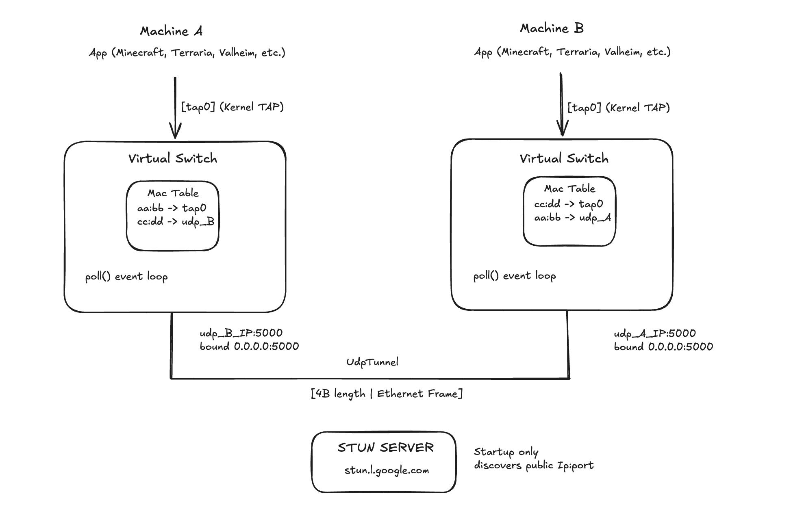

<div align="center">

# VirtualSwitch

**Layer 2 virtual switch with UDP tunneling for LAN gaming over the internet**


</div>

---

Play Minecraft, Valheim, or any LAN game with friends across the internet without subscriptions or port forwarding. VirtualSwitch makes your computers appear on the same local network.

## Features

- LAN Gaming Over Internet - Play peer-to-peer without dedicated servers
- UDP Tunneling - Transparent frame forwarding across internet
- MAC Learning - Automatic MAC address table with 300s TTL aging
- Broadcast/Multicast - ARP and game discovery frames correctly flooded to all peers
- Peer Validation - Frames from unknown sources are dropped
- Efficient - Poll-based event loop, zero per-frame heap allocations
- Multi-port - Support unlimited local TAPs and UDP peers
- No Setup - Works same machine, LAN, or internet

## Build

```bash
mkdir -p build && cd build
cmake ..
make
sudo ./vswitch --help
```

Requirements: Linux, C++17, CMake 3.15+

## Quick Start

**Computer A** — run this, it will print your public IP:port:
```bash
sudo ./vswitch --local tap0 --stun stun.l.google.com:19302 --udp 0.0.0.0:5000:B_IP:5000
sudo ip addr add 10.0.0.1/24 dev tap0
sudo ip link set tap0 up
```
Output: `Your public address: 203.0.113.5:5000  <-- share this with your peer`

**Computer B** — replace `A_IP` with what A printed:
```bash
sudo ./vswitch --local tap0 --stun stun.l.google.com:19302 --udp 0.0.0.0:5000:A_IP:5000
sudo ip addr add 10.0.0.2/24 dev tap0
sudo ip link set tap0 up
```

**With encryption** — generate a key and pass it to both peers:
```bash
cat /dev/urandom | head -c 32 | xxd -p -c 32

sudo ip link set tap0 mtu 1414
```

**Test:**
```bash
ping 10.0.0.2
```

Then start Minecraft on both machines - server appears in LAN list automatically.

## Architecture



**Frame Flow:**
1. App sends packet → TAP device
2. VirtualSwitch reads frame, learns source MAC
3. Broadcast/multicast → flood to all peers. Unicast → MAC table lookup
4. Known destination → forward directly. Unknown → flood to all peers
5. UDP peers: frame is encapsulated and sent over internet
6. Remote switch decapsulates, forwards to local TAP → remote app receives normally

**Frame Encapsulation (no encryption):** `[4-byte length][Ethernet frame]`

**Frame Encapsulation (with encryption):** `[4-byte length][24-byte nonce][ciphertext + 16-byte tag]` — XChaCha20-Poly1305

## Usage

```
./vswitch [OPTIONS]

  --local <name>            Add local TAP device
  --udp <local_ip:port:remote_ip:port>  Add UDP peer
  --key <hex>               32-byte pre-shared key in hex (enables XChaCha20-Poly1305 encryption)
  --help                    Show help

Example (3+ players):
  sudo ./vswitch --local tap0 \
    --udp 0.0.0.0:5000:B_IP:5000 \
    --udp 0.0.0.0:5001:C_IP:5000
```

## License

This project is licensed under the MIT License - see LICENSE.txt for details.

