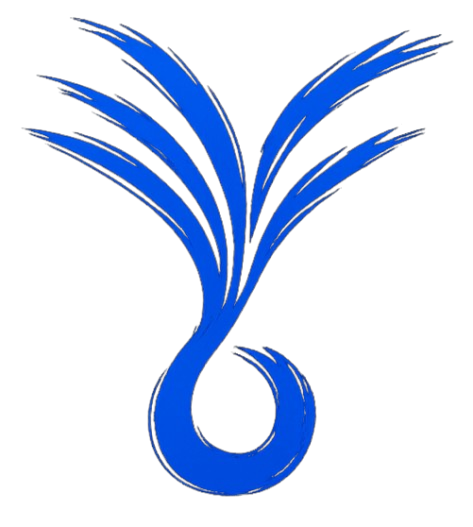

<div align="center">



# AllBlue

**Layer 2 virtual switch with UDP tunneling for LAN gaming over the internet**


</div>

---

Play Terraria, Minecraft, Valheim, or any LAN game with friends across the internet without subscriptions or port forwarding. AllBlue makes your computers appear on the same local network.

## Features

- LAN Gaming Over Internet - Play peer-to-peer without dedicated servers
- UDP Tunneling - Transparent frame forwarding across internet
- NAT Hole Punching - Automatic port probing finds a stable external port through your router
- Keep-Alive Punches - Periodic packets keep NAT mappings alive so connections don't drop
- Port Learning - Adapts to peers whose NAT remaps ports mid-connection
- MAC Learning - Automatic MAC address table with 300s TTL aging
- Broadcast/Multicast - ARP and game discovery frames correctly flooded to all peers
- Efficient - Poll-based event loop, zero per-frame heap allocations
- Multi-port - Support unlimited local TAPs and UDP peers
- Cross-platform - Runs natively on Linux, or on macOS/Windows via Docker

## Build

### Linux (native)

```bash
mkdir -p build && cd build
cmake ..
make
sudo ./vswitch --help
```

Requirements: C++17, CMake 3.15+, libsodium

### macOS / Windows (Docker)

```bash
docker compose build
docker compose run --rm peer1 bash
# inside container:
cmake -B build && cmake --build build
```

Requirements: Docker, OrbStack (macOS) or Docker Desktop

## Quick Start

Both peers need each other's public IP. Run `curl ifconfig.me` to get yours and share it.

**Peer B runs first:**
```bash
ip tuntap add dev tap0 mode tap
ip addr add 10.0.0.2/24 dev tap0
ip link set tap0 up
./build/vswitch --local tap0 --stun stun.l.google.com:19302 --udp 0.0.0.0:5000:A_PUBLIC_IP:5000
```

**Then Peer A runs:**
```bash
ip tuntap add dev tap0 mode tap
ip addr add 10.0.0.1/24 dev tap0
ip link set tap0 up
./build/vswitch --local tap0 --stun stun.l.google.com:19302 --udp 0.0.0.0:5000:B_PUBLIC_IP:5000
```

The switch probes ports automatically and prints your stable public address:
```
Port 5000 -> external 5001, trying next...
Your public address: 1.2.3.4:5002  <-- share this with your peer
```

If your NAT remaps ports (symmetric NAT), the switch warns you and continues, this still works if the other peer has a regular home router. Note: some university and corporate networks block outbound UDP entirely, which prevents direct hole punching regardless of NAT type. In those cases use a VPN like Tailscale.

**With encryption** — generate a key and pass it to both peers:
```bash
cat /dev/urandom | head -c 32 | xxd -p -c 32
sudo ip link set tap0 mtu 1414
./build/vswitch --local tap0 --key <hex_key> --stun stun.l.google.com:19302 --udp 0.0.0.0:5000:PEER_IP:5000
```

**Test:**
```bash
ping 10.0.0.2
```

Then start your game and connect via direct IP (`10.0.0.1` / `10.0.0.2`). On Linux the TAP is native so LAN discovery works automatically. On macOS via Docker, use direct IP join.

## Architecture


**Frame Flow:**
1. App sends packet → TAP device
2. The switch reads frame, learns source MAC
3. Broadcast/multicast → flood to all peers. Unicast → MAC table lookup
4. Known destination → forward directly. Unknown → flood to all peers
5. UDP peers: frame is encapsulated and sent over internet
6. Remote switch decapsulates, forwards to local TAP → remote app receives normally

**Frame Encapsulation (no encryption):** `[4-byte length][Ethernet frame]`

**Frame Encapsulation (with encryption):** `[4-byte length][24-byte nonce][ciphertext + 16-byte tag]` — XChaCha20-Poly1305

## Usage

```
./vswitch [OPTIONS]

  --local <name>            Add local TAP device
  --udp <local_ip:port:remote_ip:port>  Add UDP peer
  --key <hex>               32-byte pre-shared key in hex (enables XChaCha20-Poly1305 encryption)
  --help                    Show help

Example (3+ players):
  sudo ./vswitch --local tap0 \
    --udp 0.0.0.0:5000:B_IP:5000 \
    --udp 0.0.0.0:5001:C_IP:5000
```

## License

This project is licensed under the MIT License - see LICENSE.txt for details.

